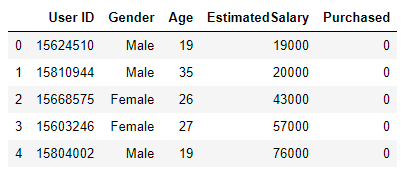
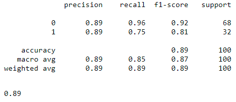

# Social_Network_Kaggle

### Social Network for Advertisement
This dataset tells about user transaction data that will purchased/not purchased a particular product.

### Preprocessing dataset
First, we will remove User ID. We need to analyze correlation between parameter. 
So you need to know value correlation coefficient in R table. 
It will help you to decide purchased column which has correlation parameter or not.

### Correlation Coefficient
R-table (400 raw data) = 0.098742 
Result Coeff : 
- Gender <> Purchased = -0.04246945626450915 > Not Valid
- Age <> Purchased 0.6224541988845291 > Valid
- Estimated Salary <> Purchased 0.36208302580467916 > Valid 

### Result

